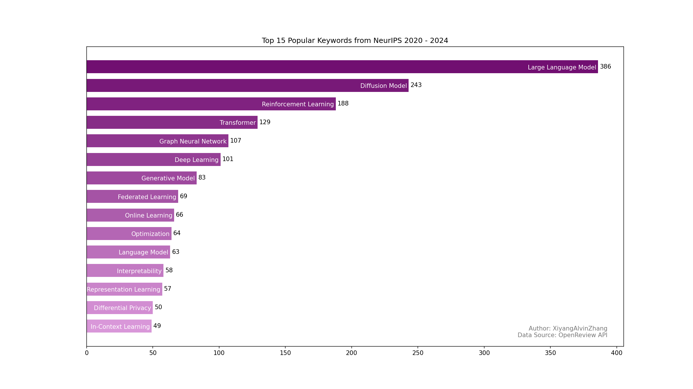

# NeurIPS_Visualization
A small visualization project of fetching and visualizing NeurIPS submission from OpenReview. 
1. Fetch the all submitted notes from OpenReview API
2. Clean the data, e.g., `LLM` -> `large language model`. 
3. Visualize the trend of keywords change in Tableau.

## Tools
- openreview-py
- matplotlib
- Tableau

## Visualization Result

