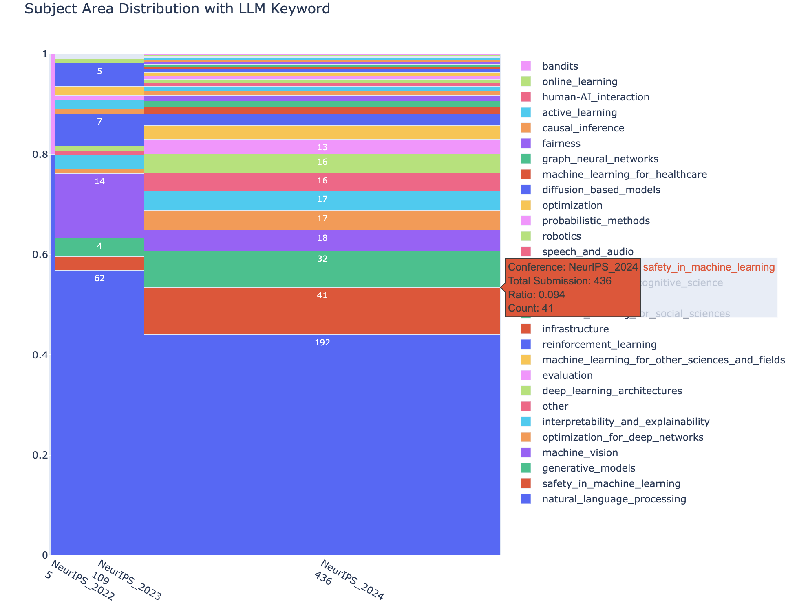

# NeurIPS_Visualization
A small visualization project of fetching and visualizing NeurIPS submission from OpenReview. 
1. Fetch the all submitted notes from OpenReview API
2. Clean the data, e.g., `LLM` -> `large language model`. 
3. Visualize the trend of keywords change in Tableau.
4. Classify subject area of NeurIPS 2021 - 2023 submitted papers by fastText
5. Visualize the distribution of subject areas among papers with LLM keywords

## Tools
- openreview-py
- matplotlib
- fasttext
- plotly
- Tableau extention, Bar Race by Inovista

## Visualization Result

<!--  -->
<!--  -->
<!-- { % include_relative graphs/paer_submissions_with_llm_keyword_trend.html % }  -->
<!-- { % include_relative graphs/subject_area_distribution_with_llm_keyword.html % }  -->

## TODO
- Re-write data wrangling code into functions to increase readability.
- Fix the plotly html plot into README.md or [embed into Github Pages](https://automating-gis-processes.github.io/2016/Lesson5-share-on-github.html)
- Access all reviews from OpenReview API.
- Apply funnel analysis from submission to accept. 

## Reference

- [OpenReview API - How to Get All Submissions](https://docs.openreview.net/how-to-guides/data-retrieval-and-modification/how-to-get-all-submissions)
- [fedebotu - ICLR2023-OpenReviewData](https://github.com/fedebotu/ICLR2023-OpenReviewData/tree/main)
- [Inovista Bar Race Chart for Tableau](https://www.inovista.com/animatorFiles/demoProjects/BarRaceTableau.html)
- [Text Classification by `fastText`](https://fasttext.cc/docs/en/supervised-tutorial.html)